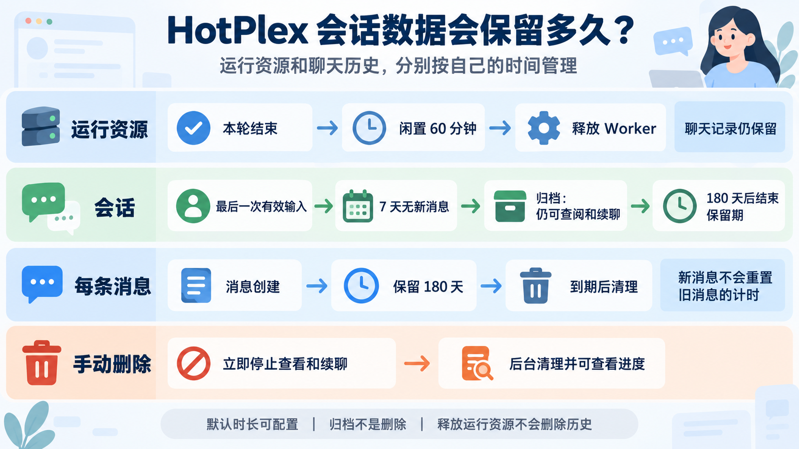

# Session 生命周期

> 为什么 HotPlex 的 Session 需要 5 个状态（而非常见的 3 个），以及这套状态机如何支撑 Worker 进程的完整生命周期管理。



## 核心问题

HotPlex Gateway 是一个多租户的 AI Agent 接入层。每个用户会话背后运行着一个独立的 Worker 进程（如 Claude Code CLI）。Session 管理需要解决三个核心矛盾：

1. **资源复用 vs 及时释放**：Worker 进程启动成本高（数秒），但每个进程占用约 512 MB 内存，不能无限保留。
2. **断连恢复 vs 状态一致**：WebSocket 连接不稳定，用户可能短暂断开后重连，此时需要决定是恢复旧会话还是创建新会话。
3. **多平台语义差异**：同一个用户在 Slack 频道、飞书群聊、WebChat 中的会话需要独立管理，且 ID 不能冲突。

传统的 3 状态模型（Created → Running → Terminated）无法表达"进程暂停但未终止"的中间状态。缺少这个状态，系统只能在"立即终止"和"永远保留"之间二选一。

## 设计决策

### 5 状态机的选择

```
CREATED → RUNNING → IDLE → TERMINATED → DELETED
   ↑                    ↓            ↑
   └─── RESUME ←────────┘    │
          └──────────────────────┘
```

| 状态 | `IsActive()` | 语义 | 持续时间 |
|------|-------------|------|---------|
| `CREATED` | true | 已创建，Worker 尚未启动 | 瞬态（<1s） |
| `RUNNING` | true | Worker 正在执行，处理输入 | 业务执行期间 |
| `IDLE` | true | Worker 暂停，等待新输入或重连 | `idle_timeout` 到期前 |
| `TERMINATED` | false | Worker 已终止，保留元数据供 resume | `retention_period` 到期前 |
| `DELETED` | false | 终态，记录已删除 | 永久 |

**为什么是 5 个而非 3 个**：

- **IDLE 状态**是关键区分。它表示"Worker 进程还在，但当前没有任务"。WebSocket 断开时，Session 进入 IDLE 而非 TERMINATED，这样用户重连后可以立刻恢复（Fast Reconnect），省去重新启动 Worker 进程的开销。
- **TERMINATED** 不同于 DELETED。TERMINATED 的 Session 保留数据库记录，因为 Worker 的 session 文件可能还在磁盘上（如 Claude Code 的 `~/.claude/projects/<hash>/sessions/`），`--resume` 可以恢复对话历史。只有 DELETED 才真正清理记录。
- **CREATED** 作为瞬态存在，是为了支持"先创建 Session 再异步启动 Worker"的解耦模式。

### 合法转换规则

代码中的 `validTransitions` 映射严格定义了所有合法转换：

```go
var validTransitions = map[SessionState]map[SessionState]bool{
    StateCreated:    {StateRunning: true, StateTerminated: true},
    StateRunning:    {StateIdle: true, StateTerminated: true, StateDeleted: true},
    StateIdle:       {StateRunning: true, StateTerminated: true, StateDeleted: true},
    StateTerminated: {StateRunning: true, StateDeleted: true}, // resume / GC
    StateDeleted:    {},                                         // 终态
}
```

关键设计点：

- **`RUNNING → RUNNING` 是非法的**，这保证了幂等性。重复的 `Transition(RUNNING)` 调用不会产生副作用。
- **`TERMINATED → RUNNING` 允许 resume**。用户可以在旧会话上恢复，而不是强制创建新会话。
- **`RUNNING → DELETED` 直接路径**用于管理员强制删除，跳过中间状态。

### 确定性 Session Key：UUIDv5

HotPlex 使用 UUIDv5（SHA-1 哈希 + 固定命名空间）生成确定性的 Session ID。相同的输入永远产生相同的 ID，这是平台消息路由的基石。

**两种 Key 派生方式**：

1. **通用 Key**（`DeriveSessionKey`）：`SHA1(namespace, ownerID|workerType|clientKey[|workspaceID]|workDir)`，适用于 WebChat 和直连 WebSocket。`clientKey` 是客户端传入的 `client_session_id`（REST）或 `session_id`（WS init），经过 `SanitizeText()` 清洗和 `MaxClientKeyLen`（256 字符）长度校验。`workspaceID` 是 WebChat 多租户锚点（spec ① 方案3），仅非空时加入派生——不同 workspace 即使其余字段相同也得到不同 Session Key；切换 workspace 或 worker_type 均产生新 Key（spec ③ 锁定此不变量）。
2. **平台 Key**（`DerivePlatformSessionKey`）：根据平台类型拼接不同字段：
   - Slack：`ownerID|wt|slack[|teamID][|channelID][|threadTS][|userID][|workDir]`
   - 飞书：`ownerID|wt|feishu[|chatID][|threadTS][|userID][|workDir]`
   - Cron：使用独立的 `CronNamespace`，确保与平台会话永不冲突。

**为什么用确定性 ID 而非随机 ID**：

当 Slack 频道的一条消息到达时，Gateway 需要知道这条消息属于哪个 Session。确定性 ID 使得 `(ownerID, channelID, threadTS)` 三元组永远映射到同一个 Session，无需额外的映射表或缓存查询。如果使用随机 ID，就需要维护一个 "频道 -> Session" 的外部映射，增加了一层一致性问题。

**Cron 的独立命名空间**：

Cron 任务每次执行都会产生新的 Session（`DeriveCronSessionKey(jobID, epoch)`），使用独立的 `CronNamespace`。这解决了早期设计中 Cron 会话与 Slack/飞书会话 ID 冲突导致 100% 超时的问题。

**Agent 身份派生（#848）**：

与 Session Key 同源的 UUIDv5 思路也用于派生 Agent 身份 ID（`agentspec.DeriveAgentID`）：`SHA1(agentIdentityNamespace, userID|workspaceID|agentName|workerType)`，使用与 session-key 命名空间隔离的独立子命名空间，故 AgentID 永不与真实 Session ID 冲突。AgentIdentity 是 secret-free 值对象，绑定在 session 上（折叠进现有 `context_json` 列，无迁移），并在 `init_ack` 元数据 / audit detail_json / `forward_events` trace span 三处以统一 key（`agent_id` 为主）传播，供跨 session/event/audit/trace 按 agent 身份关联。身份是 session 级的：`/reset` 清空 Context 后身份仍存活，并在下次持久化时重新写入。详见 `docs/v2/API-DESIGN.md` §Agent Identity。

**有效 AgentSpec 快照持久化（#866）**：

启动 session 时所用的有效、无密钥运行时策略被冻结为 `agentspec.EffectiveAgentSpecSnapshot`（版本化 + 内容哈希），与身份共用同一套 context_json 折叠机制（reserved key `_agent_spec`，无迁移）。它的核心价值是**让 resume/restart 重建同一份运行时契约**：`AllowedTools` 是唯一仅存内存、无 DB 列的有效策略字段——没有快照，重启后 session 会静默丢失工具边界。`bindSpecSnapshot` 在 `CreateWithBot` 从有效字段派生（仅当存在工具白名单时），scan 时 `RestoreAllowedTools` 回填。于是**配置变更不会静默改变既有 session 的有效策略**：resume 读到的是持久化快照，而非重新从（可能已漂移的）config 派生。快照同样在 `/reset` 后存活（session 级），其 `spec_version`/`spec_hash` 盖章进 audit detail_json 供关联。详见 `docs/v2/API-DESIGN.md` §Effective AgentSpec Snapshot。

**只读 RuntimeContext facade（#852）**：

身份与快照之外，session 的完整运行时上下文还散落在 eventstore 原始事件、materialized turns、worker 自身 session id、workspace agent 配置四个来源。`runtimecontext.Facade` 把它们聚合进一个只读 `ContextSnapshot`，**不写入、不改语义**——eventstore 与 turns 仍是权威，facade 只观察。它只依赖自身的 `SessionReader`/`EventReader`/`TurnReader`/`WorkspaceReader` 接口，具体适配器是唯一接触 store 类型之处，故 store 内部结构不外泄，未来内存后端可无缝替换。session 源权威且必需（未知 session 无法伪造上下文），其余三源 best-effort：无事件/无轮次/无 workspace（如平台、cron 会话）只记 debug 日志并留零值，绝不阻断 Load，resume/fork/history 行为因此对非 webchat 会话保持不变。`ContextSnapshot` 复用 #848 身份与 #866 快照这两个无密钥域类型，`EventSummary` 刻意省略 Data 载荷以保持有界。`Save`/`ContextUpdate` 留待后续 slice（接口已预留目标形状）。详见 `docs/v2/API-DESIGN.md` §Runtime Context API。

## 内部机制

### 双层锁架构

Session Manager 使用两层 Mutex 保护并发安全：

```
Manager.mu (保护 sessions map)
    └── managedSession.mu (保护单个 session 的状态和 worker)
```

**固定锁顺序**：始终先 `Manager.mu` 后 `managedSession.mu`，这是防止死锁的关键。

**锁释放再获取模式**：`transitionState` 方法在写数据库时临时释放 `managedSession.mu`（因为 SQLite I/O 可能阻塞数十毫秒），写完后再重新获取。如果数据库写入失败，则回滚内存状态。

```go
func (m *Manager) transitionState(...) error {
    ms.info.State = to           // 在锁内修改内存状态
    info := ms.info
    ms.mu.Unlock()               // 释放锁，允许其他操作

    dbErr := m.store.Upsert(...)  // 数据库写入（可能阻塞）

    ms.mu.Lock()                  // 重新获取锁
    if dbErr != nil {
        ms.info.State = from      // 回滚
        return dbErr
    }
    // 继续后续处理（终止 worker、更新 metrics）
}
```

### 原子性保证：TransitionWithInput

`TransitionWithInput` 是整个状态机中最关键的方法。它将状态转换和用户输入处理放在同一个 Mutex 保护下，防止 done/input 竞态：

```
场景：Worker 正在执行 Turn A（RUNNING），用户发送 Turn B 的输入

无原子性保护：
  1. Worker 完成 Turn A，发送 done，状态 -> IDLE
  2. 用户输入到达，状态需要 IDLE -> RUNNING
  3. 如果 step 1 和 step 2 并发执行，可能导致：
     - 输入丢失（状态已变但输入未处理）
     - 状态不一致（IDLE 但收到了新输入）

原子性保证：
  1. 在 ms.mu.Lock() 内同时执行：状态检查 -> 状态转换 -> 输入投递
  2. 要么完整执行，要么都不执行
```

此外，`TransitionWithInput` 还包含 **MaxTurns 反污染机制**：当 Turn 计数超过 `worker.MaxTurns()` 时，强制终止 Session。这防止了恶意或错误的无限循环消耗资源。

### Worker 配额管理：PoolManager

PoolManager 提供三层配额控制：

| 维度 | 配置项 | 默认值 | 语义 |
|------|--------|--------|------|
| 全局总数 | `MaxSize` | 100 | 系统级最大并发 Worker |
| 每用户数 | `MaxIdlePerUser` | 5 | 单用户最大活跃 Session |
| 每用户内存 | `MaxMemoryPerUser` | 3GB | 单用户总内存上限 |

**配额获取**（`AttachWorker`）：

```go
// 1. 尝试获取并发槽位
pool.Acquire(userID)      -> PoolExhausted / UserQuotaExceeded

// 2. 尝试获取内存配额（每个 Worker 按 512 MB 估算）
pool.AcquireMemory(userID) -> MemoryExceeded

// 3. 成功：记录 worker + startedAt + metrics
```

**配额释放**（`DetachWorker`）：

配额释放使用 CAS（Compare-And-Swap）语义的 `DetachWorkerIf`，防止 stale goroutine 误释放新 Worker 的配额。旧 `forwardEvents` goroutine 在 Worker 崩溃后退出时，如果发现当前 Worker 已经被替换，会跳过释放操作，避免 pool double-release。

### GC 与独立生命周期时钟

Session GC 由一个后台 goroutine 驱动（默认 60 秒扫描一次），处理运行回收和 Legacy 终止记录清理：

**第 0 层：Zombie IO 轮询**（RUNNING 状态）
```
对 RUNNING session 的 Worker 检查 LastIO() 时间戳。
如果超过 ExecutionTimeout（默认 30 分钟）无 IO 活动，判定为僵尸进程，强制 TERMINATED。
```

**第 1 层：Max Lifetime 到期**
```
Session 的 expires_at 由 session.retention_period 设置，并可在有效输入后重置。
到期后强制 TERMINATED，释放 Worker 进程。
```

**第 2 层：Idle Timeout 到期**
```
IDLE session 的 idle_expires_at = entered_idle_at + IdleTimeout。
到期后 TERMINATED，回收暂停的 Worker 进程。
```

**第 3 层：TERMINATED 记录清理**
```
Legacy TERMINATED session 按 source 差异化保留：
  cron 类：updated_at ≤ now - cron_term_retention（默认 24h）→ DELETE
  其他：updated_at ≤ now - term_retention（默认 7d）→ DELETE
```
v2 会话不进入这条短期 Legacy 删除路径。其归档、会话和正文分别使用 `lifecycle.conversation.archive_after`、`lifecycle.conversation.retention_after_last_input` 与 `lifecycle.content.retention`：默认 7 天标记归档，180 天保留会话，单条正文各自保留 180 天。正文读取会排除已过期内容；v2 会话到期后，GC 会先检查运行和恢复义务，再退役会话并排队异步清理。用户主动删除也会建立持久清理任务；所有者可通过 `GET /api/sessions/{id}/cleanup` 查询会话元数据、正文和 Worker 副本的清理状态。Legacy 存量数据可经 Admin API 只读预览并逐批显式延长期限；缺失可靠活动时间或已经删除的数据不会被自动补造或恢复。

**删除范围**：HotPlex 会立即隐藏本地历史、禁止续聊，并异步清理 HotPlex 管理的聊天正文和关联 Worker 会话；少量清理状态、执行去重和审计事实仍按各自保留期保存。删除不会撤回 Slack、飞书等外部平台上已经发送的消息，也不会修改已生成的数据库备份。恢复包含已删除会话的旧备份可能使这些数据重新出现。外部消息保留由对应平台管理；备份保留、销毁及恢复后的再次清理由部署方管理。

v2 轮次的 `worker.turn_timeout` 是绝对期限，默认 30 分钟；流式输出不会延长该期限。`worker.idle_timeout` 仍独立负责空闲 Worker 回收，因此延长聊天历史不会延长 Worker 运行时间。

### Fast Reconnect 优化

WebSocket 重连时，如果 Worker 仍然存活，系统跳过完整的 terminate + resume 周期：

```go
// conn.go -- performTransition
if ms.info.State == RUNNING && ms.worker != nil {
    // Worker 还活着，直接复用，跳过 running->running 非法转换
    return nil
}
```

这避免了断连恢复时的秒级延迟。

### Bridge 编排层

`Bridge` 是 Session Manager 和 Gateway 之间的编排层，处理 Session 的完整生命周期：

**StartSession** 流程：
1. `sm.CreateWithBot()` -- 创建 Session 记录（CREATED）
2. `buildWorkerInfo()` -- 构造 Worker 配置（含 MCP 注入、环境变量）
3. `createAndLaunchWorker()` -- 启动 Worker 进程 + `forwardEvents` goroutine
4. `sm.Transition(RUNNING)` -- 状态转换

**StartPlatformSession** 决策树（幂等）：
```
1. 无 DB 记录     -> 创建 + Start (--session-id)
2. Worker 存活    -> 复用（直接转发消息）
3. 无 Worker, CREATED    -> Start (--session-id)
4. 无 Worker, RUNNING/IDLE/TERMINATED -> Resume (--resume)
   如果 Resume 失败（文件丢失），降级到 Start (--session-id)
   Resume 和 Start 使用独立的 30s 超时 context，Resume 失败不消耗 Start 的超时预算
```

**ResetSession** 使用递增的 generation counter 代替布尔标志，消除了旧设计中的竞态条件——旧 `forwardEvents` goroutine 可以通过 generation 比较准确判断是否应该跳过 crash 处理。

## 权衡与限制

### 已知的权衡

1. **SQLite 单写瓶颈**：所有状态持久化通过 SQLite WAL 模式串行化。在极高并发下（>100 并发 Session），数据库写入可能成为瓶颈。这是选择嵌入式数据库的代价——换来了零外部依赖的部署简易性。

2. **内存 map 与 DB 双存储**：所有活跃 Session 同时存在于 `map[string]*managedSession` 和 SQLite 中。优点是读取零 IO，缺点是重启时需要从 DB 重新加载（`RepairRunningSessions` 修复孤儿 Session）。

3. **IDLE 超时不可按 Session 定制**：所有 IDLE Session 共享同一个 `IdleTimeout`，不支持"A 用户的 Session 保留 1 小时，B 用户的保留 5 分钟"。

4. **到期退役采用安全门控**：v2 会话过期后由 GC 发起退役，先复核期限和持久化状态，再原子写入删除标记与 cleanup outbox。仍有活动 Worker、未完成或状态未知的输入/执行、排队任务或清理任务时会跳过；存量 legacy 会话不会自动升级策略。用户主动删除和到期退役共用可重试的持久清理任务，进度可查询。

### 并发安全边界

- **锁顺序必须严格遵守**：`Manager.mu -> managedSession.mu`，违反此顺序会死锁。
- **Worker.Terminate() 必须在 ms.mu 释放后调用**：`transitionState` 返回需要终止的 Worker 引用，由调用方在锁外执行 Terminate。这是为了避免 Terminate 阻塞（进程优雅关闭可能耗时数秒）期间锁住所有并发读操作（Get、GetWorker），导致 Session 永久无响应（#655）。
- **callback 调用（OnTerminate、StateNotifier）在独立 goroutine 中执行**：防止用户回调阻塞 GC 循环。

## 参考

- `internal/session/manager.go` -- Manager 实现、状态转换、GC
- `internal/session/key.go` -- UUIDv5 确定性 Key 派生
- `internal/session/pool.go` -- PoolManager 配额管理
- `internal/session/store.go` -- SQLite 持久化
- `internal/gateway/bridge.go` -- Session-Worker 生命周期编排
- `internal/gateway/hub.go` -- WebSocket Hub 广播与连接管理
- `pkg/events/events.go` -- 5 状态定义与合法转换

---

## 相关实践

- [Session 管理指南](../guides/developer/session-management.md) — 日常运维中的 Session 操作（/gc、/reset、Resume）
