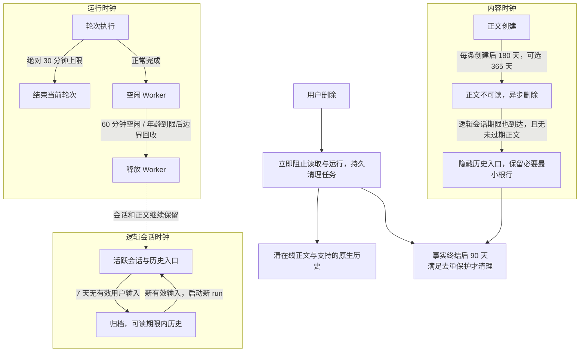

# HotPlex 数据生命周期与时长治理实施方案

- 日期：2026-10-08（Asia/Shanghai）。
- 用户确认（2026-10-08）：方案数字作为默认值，并提供可配置参数；用户会话和正文默认 180 天，365 天是配置示例而非唯一可选值，归档不缩短保留期。此确认不等于在运行实例开启策略或执行存量迁移。
- 核验基准：`4c7c685a`；实施前重新确认目标分支、HEAD 和相关文件。
- 文档性质：用户已确认目标与默认时长；本分支按此方案实施，存量数据操作、服务重启和发布仍需独立安排。
- 范围：WebChat、Slack、飞书、Cron/API 的会话生命周期及关联数据；四类 Worker 的历史清理能力。
- 所有“拟新增”字段、文件、接口、配置和测试均为设计，不代表现有功能。
- 证据：Source 为本地源码核对；Test 为本会话此前执行的选定测试；Live 尚未核验运行实例配置、数据库内容和真实渠道删除。

## 1. 问题结论

HotPlex 已有持久输入、租约、删除事务和异步 Worker 清理的基础，但没有统一的数据生命周期契约。需要优先修正的是生命周期边界，其次才是默认天数。

| 问题 | 可观察结果 | 推荐方向 |
| --- | --- | --- |
| 运行期限与历史索引生命周期耦合 | Worker 因空闲结束后，会话索引按终止期限删除；正文仍在但普通历史接口返回 404 | 运行释放、归档、正文到期独立计时 |
| `turn_timeout` 实际随事件滑动 | 不断输出的轮次可持续重置计时，无法作为绝对执行期限 | 绝对轮次期限与无 IO 检测分离 |
| 删除依赖入口及内存命中 | WebChat 物理删除；Manager.Delete 命中缓存时软删，未命中时可能物理删 | 单一删除契约，持久化删除意图和完成状态 |
| 长期审计保存输入正文 | 聊天正文默认 30 天，审计输入正文默认约三年 | 审计事实不复制正文；历史明文专项迁移 |
| 投递正文和部分事实无自动清理 | `effect_payloads` 等持续累积，删除会话并不清除这些副本 | 正文、恢复义务、去重证据分别保留 |
| Worker 原生历史清理能力不一致 | OCS 可清理，其他 Worker 没有统一删除实现 | 显式报告能力和范围，不能把 no-op 当成功 |

Source 级复现条件：使用默认配置创建会话，轮次结束进入 IDLE；空闲 60 分钟后运行终止，再超过终止记录保留期，GC 删除 `sessions`；30 天以内的 `turns` 可能仍存在，但 `GetHistory` 先要求会话存在。未执行真实实例复现，不据此判断用户某条会话的实际删除原因。

目标是使“停止运行”“归档会话”“正文到期”“删除聊天”有稳定、可解释的含义，而不是把所有表改成同一 TTL。

## 2. 当前实现与根因

### 2.1 当前事实与定位

仓库根目录为 `/Users/hrygo/hotplex`；下表路径均相对该根目录。

| 路径 / 符号 | 已核实的当前行为 |
| --- | --- |
| `internal/config/config_defaults.go` | Session 活跃到期 7 天；普通终止记录 7 天、Cron 24 小时；Worker 空闲 60 分钟、无 IO 检测 30 分钟，`turn_timeout` 默认 0 |
| `internal/session/manager.go`：`CreateWithBot`、`ResetExpiry`、`gc` | 创建和恢复设置 `ExpiresAt = now + RetentionPeriod`；普通消息没有逐次续期；终止记录清理依赖 `UpdatedAt`；TERMINATED 内存缓存另有 24 小时 TTL |
| `internal/session/sql/queries/store.delete_terminated_by_id.sql` | 按 TERMINATED、source 和 updated_at 删除；不扫描 DELETED |
| `internal/gateway/bridge_forward.go`：`forwardEvents`、`processForwardedEvent` | 创建 `turnTimer`，处理事件时调用 `turnTimer.Reset`；Done 路径停止计时。开启后更接近事件静默计时，不能据名称当作绝对轮次期限 |
| `internal/session/manager.go`：`Delete`、`DeletePhysical` | 删除行为存在内存分支；有持久 cleanup outbox 和运行态删除屏障，但不是全量内容清理接口 |
| `internal/gateway/api.go`：`DeleteSession`、`GetHistory` | REST 删除走物理删除；历史读取先 `authorizeSession`，再读 turns |
| `internal/gateway/commands.go`、`cmd/hotplex/admin_adapters.go` | AEP 删除及管理端调用 Manager.Delete；AEP `control.stop` 保留会话且不能触发 crash fallback |
| `cmd/hotplex/gateway_run.go`：`runEventsGC` | 每小时分别删除到期 events / turns；按记录创建时间，默认 30 天 |
| `internal/gateway/handler.go`：`emitAudit`；`internal/audit/gc.go` | `detail_json` 存输入 content；审计默认约三年，按检查点锚定的前缀清理 |
| migrations `023_user_activity`、`030_audit_no_delete` | 审计禁止普通 UPDATE，DELETE 有检查点约束；不能直接逐会话改写正文 |
| migrations `026_execution_inputs`、`037_execution_queue`、`038_execution_queue_payloads` | 执行事实仅保存指纹等；会话物理删除级联执行事实和队列；队列正文随队列控制记录删除 |
| `internal/execution/sql_queue_dispatch.go` | 队列取消、清空、领取、过期结算删除队列正文，保留相应执行事实 |
| migrations `033_cron_occurrences`、`034_effect_ledger`、`036_effect_attempts`、`039_effect_reconciled_terminal` | 批次、投递事实、回执和最终回复快照与会话无统一删除级联；未发现这些模块的自动保留清理入口 |
| `internal/effect/store.go` | 已区分正文缺失与事实损坏；租约过期进入 unknown，不恢复成可发送状态 |
| `internal/session/cleanup_outbox.go`；`internal/worker/session_cleanup.go` | 本地删除与清理入队原子执行，远端失败重试；当前仅 OCS 注册原生历史删除，未注册类型会 no-op |
| `cmd/hotplex/gateway_run.go`：`sm.OnTerminate` | 同时清 volatile 缓冲、持久队列和附属 Cron；运行释放与逻辑会话结束的副作用目前耦合 |

图谱 generation 为 `2026-10-01T23:35:45Z`，已对核心引用文件进行 coverage 检查。变更文件、未索引文件和 SQL 未解析范围使用本地源码补证；图谱干净不等于已验证运行状态。

### 2.2 根因分类

1. **领域定义缺口**：单个 sessions 记录同时承载运行状态、历史鉴权入口及删除关联根，运行结束因此牵动历史可见性。
2. **时钟定义缺口**：复用 `UpdatedAt` 作为保留起点；`turn_timeout` 名称与滑动实现不一致；`worker.max_lifetime` 存在配置，但不能仅看默认值认定进程年龄回收已接线。
3. **副本清单缺口**：聊天正文另有审计、effect 快照、原生 Worker 历史及调试追踪副本。
4. **清理完成契约缺口**：本地删除成功与所有副本删除成功没有分开表达。
5. **原先缺少明确默认策略**：用户已确认本方案数字作为默认值，实施应提供参数覆盖；调整实际运行配置和缩短存量数据期限是独立操作。

### 2.3 历史约束

> 🧠 **From Hindsight memory (HotPlex 可信运行与投递演进)** — 历史方案要求复用既有 Gateway → Session/Execution → Worker、鉴权和审计体系；不另建 execution 状态机或平行调度系统；unknown 不自动重发；SQLite/PostgreSQL 迁移成对，协议变化同步各 SDK。

当前 `internal/effect/store.go` 的租约契约与 unknown 禁止自动重发一致。原方案入口为 `/Users/hrygo/hotplex/docs/superpowers/plans/2026-10-03-hotplex-evolution-luna-guide.md`。历史实施报告不替代本批验收，本方案不重复认领 PR #986 的原十项问题。

## 3. 目标行为

### 3.1 四类生命周期

- **运行**：管理进程、轮次和排队义务；到期停止或释放资源，不删除聊天。
- **会话**：管理身份、归属、上下文代际和历史入口；无输入达到归档期限后仍可读取未过期正文。
- **内容**：每个正文副本有创建时间、期限和所属主体；到期不再返回，后台完成物理清理。
- **证据**：执行结果、回执和去重标记有独立调查窗口；清理不能重新开放已执行副作用。



图中归档是产品投影，不是新增 AEP State；90 天事实期限不覆盖未收敛义务和未闭合的重放窗口。

### 3.2 已确认的 v2 默认策略及精确计时规则

以下数字已由用户确认为默认值；新安装和新写入记录默认使用 `v2` 生命周期，允许通过 §4.3 参数覆盖。既有记录在新增策略标记为空时按原行为保留；存量期限变化必须通过预览与独立 apply 完成。`legacy` 仅作为明确配置的回退策略，不是升级默认值。

| 对象 | 默认值 / 覆盖规则 | 起算事件 | 可续期事件 | 到期行为 |
| --- | --- | --- | --- | --- |
| Worker 空闲 | 60 分钟 | 当前轮次终结且无可立即派发输入 | 新输入真正开始执行 | 释放 Worker，保留逻辑会话 |
| Worker 年龄 | 24 小时 | 此 Worker run 成功启动 | 无 | 标记待回收，在轮次边界替换；不复用旧 run ID |
| 单轮绝对期限 | 30 分钟 | Worker.Input 成功投递时记录的 turn_started_at | 无；输出、交互卡、心跳不延长 | 中断本轮，持久结算失败/unknown，保留会话 |
| 无 IO 检测 | 暂保留 30 分钟 | 最后实际 Worker IO | 实际 IO | 先检查运行是否仍归本 run；不能当安全重投依据 |
| 长任务 | 显式覆盖，例如 2 小时 | 同单轮规则 | 无 | 不因归类为 Cron 就自动无限运行 |
| 交互式持久队列 | 15 分钟 | 持久接受事务的 enqueued_at | 无 | 结算过期，删除待执行正文，通知用户 |
| Cron 队列 | 保持既有 24 小时上限，优先使用任务 deadline | 接受事务 | 无 | deadline 与 TTL 取较早值；不得事后突发执行过时任务 |
| 逻辑会话归档 | 7 天 | last_input_at | 首次接受的有效用户输入；重复 ACK 不续期 | 归档显示；只释放空闲运行，可恢复新 run |
| 用户逻辑会话 | 无有效用户输入后 180 天，可显式选择 365 天 | 创建时间 / last_input_at | 首次接受的有效用户输入；读取、改标题不续期 | 同时无未过期正文且无运行/恢复义务时才自然退休；7 天归档不触发删除 |
| 用户聊天 events / turns | 180 天，可显式选择 365 天 | 每条记录 created_at | 无；继续聊天不延长旧正文 | 读取时过滤到期正文，后台清理；用户会话不套用短期投递/调试 TTL |
| 会话历史索引 | max（逻辑会话期限，最后正文到期时间） | 创建 / 新输入 / 新正文的 expires_at | 用户输入和新正文可延长索引；查看、改标题不延长 | 先隐去历史入口、清内容性元数据，必要最小墓碑另行保留 |
| 已完成投递正文 | 7 天 | 投递义务收敛时间 | 无 | 删正文，事实和回执继续保留 |
| 执行/批次/投递事实 | 90 天 | 确定终态 finished_at / settled_at | 无 | 满足去重和引用保护后删除或压缩为最小标记 |
| 新审计事实 | 180 天 | 事件 ts | 无 | 检查点锚定清理；实际审计要求可覆盖 |
| 审计正文 | 默认不采集 | — | — | 有必要时独立 opt-in，最多跟随聊天正文期限 |
| 媒体缓存 | 24 小时 | 下载写入时间 | 不因读取延长 | 保留现有目录所有权检查后清理 |
| ACP 调试正文 | 48 小时及现有大小上限 | 追踪文件创建/最后写入时间 | 写入期间不删；关闭后固定计时 | 只删除 HotPlex 创建的 trace 文件 |
| 普通文件日志备份 | 保持 30 天，兼顾容量限制 | 轮转备份形成时间 | 无 | 不把轮转期限解释成活动文件内每行 TTL |
| 本机备份 | 策略默认 30 天，由备份工具配置 | 备份产生时间 | 无 | 仅受管理备份适用，恢复先重放删除清单；不据此自动启用或删除现有备份 |

登录 Cookie 有独立认证有效期，不能用聊天会话 TTL 替代。账户、工作区、Agent 配置、用户工作目录、外部平台消息和用户主动导出不纳入会话 GC；明确展示边界。

### 3.3 用户可观察契约

1. 自动释放空闲 Worker 后，列表和历史仍可用；续聊开始新 run，不把旧执行重新派发。
2. 历史只返回尚未到期正文；响应增加可选 `history_truncated` 和 `content_expires_at`，缺失时旧客户端仍可工作。
3. 停止本轮、重置上下文、归档、删除聊天分别实施；`/reset` 不是擦除历史。
4. 删除立即阻止该会话的正文读取、新输入和恢复；返回的是删除意图已持久接受，不是所有副本已擦除。
5. 后台清理状态明确区分 `pending/running/completed/blocked`；不支持远端删除返回 `unsupported`，不能映射为 completed。
6. `completed` 限定为登记的在线清理范围；需要保留的审计事实、最小去重标记、旧备份、外部消息等例外逐项列出。
7. 调整策略不隐式缩短既有数据期限；已有 deadline 重启后不重新计时。
8. 已归档会话从持久存储按需加载，保留期间无需常驻 Worker、连接或完整历史内存缓存。部分旧正文到期时说明缺失范围；会话仍在保留期内则允许开始新 run，不因历史为空强制新建身份。

### 3.4 用户反馈：冷会话长期保留

采用“短运行、长历史”的策略：60 分钟空闲释放 Worker；7 天无有效输入仅从活跃列表移入归档；归档列表仍可检索、读取和续聊。自动归档、Worker 退出和缓存淘汰不能设置 `deleted_at` 或清除会话归属。

用户已确认逻辑会话与聊天正文默认 180 天，并要求可配置；365 天是示例，也接受其他合法正时长。逻辑会话按最后一次有效用户输入计时，正文逐条按创建时间计时，两者不混用：继续聊天延长会话入口，旧消息仍按自己的期限到期。任何未过期正文都保护历史入口；即使正文全部到期，未到期的逻辑会话仍保留并提示上下文缺失。短期 Cron 运行详情、投递快照、媒体缓存和 trace 使用各自策略，不因用户聊天长期保留而整体延长。

这些天数是用户已确认的产品默认策略，官方原则不规定统一天数。相同每日写入量与存储格式下，180 天正文的稳态数据量约为 30 天的 6 倍，365 天约为 12.2 倍；这是容量估算，不是实测。数据库、搜索索引和备份仍有成本，但归档数量不应决定常驻 Worker 数量。列表使用分页与过期时间索引，续聊按需加载；容量紧张时先预警和展示策略，不以 Worker 回收或静默缩短历史保留期解决。

本批不增加默认永久保留，也不依赖用户打开历史来续命；账户删除、用户显式删会话和经批准的存量迁移仍按独立契约执行。

## 4. 推荐解决方案

### 4.1 选择范围适中的分层治理

| 方案 | 改动范围 | 判断 |
| --- | --- | --- |
| 只改配置与注释 | 小；不改模型与删除事务 | 可先改善说明，不能解决入口不一致、原生副本和哈希链正文问题 |
| 分层时钟 + 统一删除 + 模块 GC | 涉及 Session、Gateway、Execution、Effect、Audit、Worker、WebChat 的相关路径 | 推荐；保留现有领域模块，分单元交付 |
| 所有正文迁入统一内容平台并引入逐会话密钥销毁 | 改造所有正文写入者、读取者和密钥管理 | 明显扩大范围；本批不引入，可在有强擦除需求时另行评审 |

不要新增通用事件总线或独立调度服务。内容 GC 各模块负责，策略解析、时间语义、删除意图和状态汇总共用小型接口。

### 4.2 数据与状态设计（拟新增）

继续以 `sessions.id` 为既有逻辑会话标识，保留 AEP SessionState 枚举；归档是独立可选投影，不能新增一个未经同步的 AEP `ARCHIVED` 状态。

Session 增加：

- `last_input_at`：有效用户输入首次受理时间；队列接受也算一次活动。
- `runtime_finished_at`：最近一次运行结束时间，普通更新不得修改。
- `archive_at`：无用户活动归档 deadline。
- `conversation_expires_at`：逻辑会话保留期限，创建时为 now + 180 天，有效输入按当前策略向后延长；归档和运行结束不修改。
- `last_content_expires_at`、`history_expires_at`：历史读取及索引期限。
- `lifecycle_policy_revision`：确定这些 deadline 的不可变策略版本。
- `deleted_at`：显式删除或逻辑会话自然退休时间；单条正文到期不能设置，stale Upsert 不得清空。

内容表增加或由等价索引承载 `expires_at`、策略版本；既有创建时间语义保持。对旧行的 backfill 见 §6.5。

`execution_inputs` 拟新增 `turn_started_at`、`turn_deadline_at`、`turn_policy_revision`，不改既有 `started_at` 的含义。成功投递时条件写入起点和固定 deadline，已终结的 execution 不重新启动计时；后续事件、配置热更新和进程重启均不得延长期限。存量执行缺少这些字段时维持 legacy 行为，不猜测起点来追溯超时。

拟新增 `session_purge_jobs` 和 `session_purge_items`，不设会话删除级联：

- 主任务包含 job ID、session ID、授权归属快照、删除请求时间、策略版本、总体状态。
- 子项包含模块 kind、状态、attempt、lease token、next_attempt_at、完成时间和有限错误码。
- 不包含 prompt、Context、metadata 值、凭证、原始 Worker 错误或用户目录任意删除路径。
- 唯一键保证一个删除意图的模块任务不会重复；claim/complete 均校验租约 token 和版本。

**控制事实保留的最小实现**：不在本批重建全部执行 FK。会话进入 DELETED 后清正文和内容性元数据，保留最小 sessions 根行，直到其执行事实、清理义务及去重窗口允许真正删除；因此现有 execution 的 FK 不会提前级联丢失证据。界面和业务读取已看不到此根行。

该最小根行仅留身份、归属、状态、期限等必要字段；清除 title、context、工作目录、platform_key 等内容性/定位性数据前，必须把必要清理定位符移入受控任务并登记期限。新的事实入库不得借此根行继续接受输入。

无法强制限制旧请求重放的来源，暂不删除最小身份去重标记；报告例外和容量，不以“90 天最佳实践”为理由删除去重键。后续若要清理，必须先实现并验证来源重放窗口或身份代际退休机制。

### 4.3 兼容配置（拟新增键）

- `lifecycle.policy`：默认 `v2`；`legacy` 仅在明确回退时选择。按记录保存策略 revision，配置切换不能改变已写入 deadline。
- `lifecycle.conversation.archive_after`：7 天。
- `lifecycle.conversation.retention_after_last_input`：180 天，可选 365 天；空会话从创建起算。
- `lifecycle.content.retention`：180 天，可选 365 天，新 v2 用户聊天正文使用。Cron/API 来源必须显式分类，未分类输入不得自动采用更短正文期限。
- `lifecycle.effect_payload.retention_after_settlement`：7 天。
- `lifecycle.facts.retention_after_settlement`：90 天。
- `lifecycle.audit.capture_content`：false；仅适用于新记录。
- `lifecycle.audit.facts_retention`：180 天；legacy 审计链继续使用当前配置。
- `lifecycle.audit.content_retention`：180 天；仅 capture_content=true 时使用，实际正文期限还不得超过所属聊天正文期限。
- `lifecycle.media.retention`：24 小时；复用现有缓存清理器，不扩大目录删除范围。
- `lifecycle.trace.retention`：48 小时。
- `lifecycle.gc.batch_size`：100；`lifecycle.gc.interval`：1 分钟；`lifecycle.gc.max_lag`：1 小时，是观测/告警目标，不是正文续期或强制提前删除时间。
- `execution.queue.interactive_ttl`：15 分钟；既有 `execution.queue.ttl` 保持 Cron/未分类输入 fallback。

优先接通既有 `worker.max_lifetime` 为“24 小时后轮次边界回收”，复用 `worker.turn_timeout` 表示真正绝对期限；`worker.execution_timeout` 暂维持无 IO 检测。v2 交互输入的 turn_timeout 为 0 时解析为 30 分钟默认值；已有明确正值优先。拟新增 `invocation.turn_timeout` 为仅管理员配置的正值覆盖，由运行计划解析并固定到本 execution，不能信任用户输入中的任意 metadata，也不能用流式输出改变它。

旧 `session.retention_period` 保持运行到期兼容语义，不再用于 v2 历史到期；旧 `term_retention`/`cron_term_retention` 不得提前删除仍被内容或事实引用的 v2 根行。配置解析同时指定旧/新内容保留键时，以新键为准并给出脱敏警告。拟新增 retention 键拒绝显式非正值，不用 0 暗示“永远”；legacy 的 events.retention 非正值回落 30 天等既有行为保持，不改旧客户端契约。

策略变更只影响新接受的运行、新输入续期和新写入内容；新输入只向后延长既有会话期限。已有正文 deadline 只有明确的 migration apply 才能调整；升级时默认把仍存活的旧行标为 legacy 并维持原到期行为，不能静默缩短或以迁移时刻伪装用户活动。配置展示要同时返回声明值、当前有效值、是否需重启和适用 revision。

#### 可复制的目标配置示例

以下是实施后的配置契约，包含拟新增键，不能直接用于当前版本。时长使用 Go duration 的 `h`、`m`、`s` 单位，不使用不受该格式支持的 `d`：7 天为 `168h`，30 天为 `720h`，90 天为 `2160h`，180 天为 `4320h`，365 天为 `8760h`。

```yaml
# 生命周期默认启用 v2；此处列出全部默认值，便于运维覆盖和审阅。
lifecycle:
  policy: v2
  conversation:
    archive_after: 168h
    retention_after_last_input: 4320h
  content:
    retention: 4320h
  effect_payload:
    retention_after_settlement: 168h
  facts:
    retention_after_settlement: 2160h
  audit:
    capture_content: false
    facts_retention: 4320h
    content_retention: 4320h
  media:
    retention: 24h
  trace:
    retention: 48h
  gc:
    batch_size: 100
    interval: 1m
    max_lag: 1h

# 以下 Worker 参数已存在；绝对轮次期限语义需按本方案实施。
worker:
  idle_timeout: 60m
  max_lifetime: 24h
  turn_timeout: 30m
  execution_timeout: 30m

execution:
  queue:
    interactive_ttl: 15m
    ttl: 24h

# 现有文件日志轮转参数按“天”计数，不是 duration 字符串。
log:
  file:
    max_age: 30
```

将会话和正文保留一年时，同时覆盖 `lifecycle.conversation.retention_after_last_input: 8760h` 和 `lifecycle.content.retention: 8760h`；两者也可独立配置。未显式覆盖的参数使用上述已确认默认值。`invocation.turn_timeout` 默认继承有效的 `worker.turn_timeout`，管理员可对特定长任务配置 `2h` 或其他正时长；`2h` 不是所有任务的默认值。

#### 参数校验、覆盖与生效

- 复用现有配置加载和环境变量覆盖链，新键沿用 `HOTPLEX_` 加层级大写下划线形式，例如 `HOTPLEX_LIFECYCLE_CONTENT_RETENTION=8760h`；L1 验证 YAML 与 env 最终有效值，不另建配置来源。
- 时长缺省使用默认值；拟新增时长键显式 0、负值、无法解析或超出 duration 表示范围须报错。显式空值不得悄悄变成默认值。永久保留不以 0 表达，本批不新增永久保留开关。`gc.batch_size` 必须为正整数。
- `archive_after` 不得大于 `retention_after_last_input`；旧/新正文期限可以不同，历史索引始终按 §3.2 的 max 规则保护。审计 opt-in 正文的有效期限取配置期限与所属聊天正文期限的较早值；没有可靠归属和期限时不采集正文。
- 已存在的 Worker、queue、log 键保留 legacy 校验契约；v2 的 `turn_timeout=0` 兼容解析仍按上文转换为 30 分钟，不能禁用 v2 绝对期限。拟新增交互队列 TTL 不要求小于 Cron TTL，但任务 deadline 仍取较早值。
- 生命周期参数热更新生成新策略 revision，仅影响后续输入续期、新正文/队列及新轮次；Worker 运行预算在启动 run 时固定，轮次覆盖在投递时固定。已存 deadline 不重算，历史延长/缩短走独立存量 apply。GC interval/batch/max_lag 可在下一扫描周期应用；`log.file.max_age` 仍需重启。
- `lifecycle.policy` 切换作为明确的实例配置变更，初期按需重启；不能通过热更新绕过已写入的 v2 期限和删除屏障。配置诊断同时显示有效策略、revision、来源及重启要求。
- 本机备份的 30 天在备份工具自己的 retention 参数中配置；HotPlex 尚无统一备份管理器，本批不虚构一个会自动删除现有备份的配置键，也不扩大到用户导出/工作目录。

## 5. 详细实施步骤

每个单元完成条件满足后，Luna 在获得实施授权的工作分支上检查暂存 diff 并创建原子本地 commit；只包含该单元的业务实现、回归与必要文档。项目要求非 main 分支验证通过后 commit + push；远端目标必须已明确，不创建未经请求的 PR、合并或发布。本轮只写本方案，不执行这些动作。

### L0：记录缺陷与冻结基线

- 在已授权的 Issue 渠道登记独立发现：滑动 turn timeout、删除入口不一致、运行清理导致历史失联、长寿正文副本；包含基准、Source/Test/Live、触发路径、验收。
- 不并入 PR #986 原十项，不自动增加其完成计数。没有 Issue 写权限时先提交可评审 issue 草稿，不能声称已登记。
- 文件：本方案、相关模块 AGENTS、既有测试；新增 `lifecycle_*_test.go` 为拟新增。
- 完成：保存当前 legacy 行为回归，明确相对日期、测试证据和未验证部分。
- 提交点：缺陷记录与已通过的基线测试；不要故意提交持续失败的工作区。

### L1：时钟契约、配置与成对迁移

- 文件：`internal/config/{config_types,config_defaults,config_loader,watcher}.go`；`internal/session/{manager,store,pg_store}.go`；sessions SQL 查询。
- 拟新增：`internal/session/lifecycle_policy.go`，小型纯策略计算器；迁移采用当时下一个空闲版本号，SQLite 与 PostgreSQL 成对，不能修改 001–039 既有迁移。
- SessionInfo、scan/upsert 参数、局部 UPDATE、SQL mocks 和所有 store 实现同步。仅专门时钟方法写生命周期字段；stale 整行 Upsert 不得覆盖新 deadline/deleted_at。
- 将 §4.3 已确认默认值、完整 YAML 示例与环境变量绑定纳入配置实现及诊断；验证遗漏/显式空值/0/负数/溢出、归档期限约束和策略 revision 生效边界，不能只新增配置结构而不接到实际清理器。
- Execution store 和双方言 SQL 同步新增轮次起点、deadline、策略版本的条件写入及读取；将恢复行为纳入迁移 fixture。
- 提供 `Now()` 注入与事件驱动 timer seam，生产用标准时钟；不建立全仓通用时间框架。
- 初始迁移仅加 nullable 字段/索引并 backfill 辅助值，不做删除；原始 TTL 不短于原契约。
- 完成：legacy 默认保持；v2 deadline 计算、优先级、字段扫描及升级 fixture 双方言验证。
- 提交点：策略、模型、迁移、配置测试。

### L2：绝对轮次期限和安全运行回收

- 文件：`internal/gateway/bridge.go`、`bridge_forward.go`、`bridge_stop.go`、`turn_clock_test.go`；`internal/session/manager.go`。
- 删除绝对 timer 随每个事件 Reset 的行为。timer 与 `(session_id, execution_id, worker_run_id)` 绑定，在实际输入投递成功开始；Idle 不运行绝对轮次 timer，下一轮使用新 timer。
- 超时复用当前 turn stop/dispose、synthetic terminal 与持久 runtime 结算路径；只发一个 terminal，不能杀掉替换后的 Worker，不触发 crash retry。
- 无 IO 时钟仍随实际 IO 更新；不能把连接 ping 当模型进展；等待用户交互时允许健康检测识别 waiting，但绝对期限按本方案不暂停。
- `worker.max_lifetime` 到期只标待回收，轮次终结后回收；共享 OCS/Codex 服务按所属 session/run 的隔离能力回收，禁止因一个 session 到龄杀掉全局服务。
- 文件：`cmd/hotplex/gateway_run.go` 的 OnTerminate 拆分运行释放与逻辑删除副作用；v2 空闲回收不清除尚未过期队列/逻辑附属 Cron。legacy 行为单独保持直至其迁移。
- v2 附属 Cron 明确绑定逻辑会话：显式删除逻辑会话时清理，自动 Worker 空闲释放和归档不删除；用户显式 `/terminate` 既有附属任务清理语义保持。
- 完成：持续流式输出仍达绝对期限；安静健康长工具按受限覆盖运行；旧 timer 不作用于新 run；回收不丢队列或误删 Cron。
- 提交点：运行超时、回收、hooks 与回归。

### L3：历史期限与归档，先修复历史失联

- 文件：`internal/session/manager.go`、sessions 读写/GC 查询；`internal/gateway/api.go`、`bridge.go`；`internal/eventstore` 的 events/turns 查询。
- 接受输入时原子 touch last_input_at、向后延长 conversation_expires_at/history_expires_at；新正文写入同事务或可靠补偿更新 last_content_expires_at/history_expires_at，不能用一次 best-effort 更新作为可删证明。
- 归档投影与 AEP runtime State 分开；会话 GC 在 v2 中先释放运行，再按历史期限处理，禁止保留正文期间物理删除 owner/workspace 索引。
- 普通用户历史、分页、Worker hydration、Cron 历史统计、管理员事件查询都过滤过期正文，不能只有 GetHistory 过滤。
- 同步改造 `runEventsGC`：legacy 行按原契约清理，v2 行按持久化 expires_at 条件删除。不得再用全局 created_at + 30 天扫描覆盖 v2 行，否则 180 天策略只在读取侧生效却被旧 GC 提前删除；增加混合策略同库回归。
- v2 Cron 根行至少覆盖未过期正文；旧 24 小时 term retention 不覆盖内容可见性。无正文的 Cron 可维持短的运行详情期限。
- 单条正文过期不退休逻辑会话。只有 conversation_expires_at 和最后正文期限均已到达，且没有运行/恢复义务时，才隐藏历史入口并清内容性根字段；控制事实仍需要时保留最小根行。会话仍未过期时保留入口，详情提示“部分/全部正文已过期”，不展示旧全文。
- 文件：`webchat/lib/api/sessions.ts`、`webchat/app/components/chat/SessionPanel.tsx`、`webchat/lib/adapters/hotplex-runtime-adapter.ts`；仅增加归档标记与正文到期说明，不做 unrelated UI 重构。
- 完成：60 分钟空闲回收、7 天归档、30 天与 90 天后仍能读取 v2 未到期用户历史并按需续聊；180 天到期边界正确，365 天覆盖配置有效；读取/改标题不续期；过期正文在 GC 尚未执行时也不可见。
- 提交点：历史读取、索引保护与 UI 契约。

### L4：统一删除事务与可靠清理

- 文件：`internal/session/manager.go`、store/pg_store、`cleanup_outbox.go`；`internal/gateway/{api,commands}.go`、管理端 adapter。
- 拟新增：`internal/session/purge.go` 和两张 purge 表及成对迁移。
- 所有业务删除入口先校验既有 owner/workspace/scope，再调用同一 `RequestPurge`（拟新增），不因 cache hit 改变语义。`DeletePhysical` 降为清理器内部最终步骤，所有公开 adapter 不再直接绕过删除意图。
- 本地事务：持久标记 DELETED/deleted_at，建立 root/模块任务，结算未派发队列并清正文；事务失败则不声称删除受理成功。
- 提交事务后 fence 当前 run，等旧转发器退出/排空再清事件正文，阻止晚到 delta 重新写入；跨实例写路径以持久 DELETED 和条件更新为准。
- 远端删除与慢文件清理异步，不阻塞本地事务或复活会话。未知外部副作用保留安全标记，不自动重发。
- REST 保持既有删除成功响应兼容，新增可选 job ID/状态；AEP StateDeleted 保持语义并表示本地已不可访问，不承诺远端擦除完成。
- 拟新增 GET `/api/sessions/{id}/cleanup`，从授权归属快照鉴权；不通过普通 GetHistory 绕过删除屏障。管理端使用其既有 scope 与适用的 workspace 契约。
- 完成：所有入口、冷/热缓存、重启、并发 resume/delete 结果一致；DELETED 不无限保留内容性数据。
- 提交点：删除 API、任务、Runner 与双实例回归。

### L5：投递正文、证据和辅助数据 GC

- 文件：`internal/effect/store.go` 及其 SQL 实现、lease/operator/recovery 路径；`internal/cron` occurrence store；`internal/execution/sql_queue_dispatch.go`；gateway 启动接线。
- 完成投递记录设置不可变 settled_at；正文 GC 使用 terminal/settled 状态和无活动 lease 的事务条件，不能只按 created_at 删除。
- pending/started/unknown 正文尚有恢复义务时不自动清理；到期仍未收敛时转 blocked 并提醒 operator，不伪造 delivered 或自动 abandon。
- 明确用户删除撤销的是尚未发送的交付意图；已开始或未知发送先 fence，不能把未知结果改写为 not_sent。安全地清正文后保留去重身份和未知证据。
- `ErrPayloadNotFound` 保持内容缺失口径，读控制台不因此报事实损坏；恢复不得因为正文缺失重跑 Agent。
- 事实 90 天 GC 清理已结算投递的详细 `effect_attempts`，并压缩已结算 `execution_inputs` 的诊断明细；保留输入 ID、payload hash、`worker_run_id`、最终状态和 `finished_at`，同时保留 `effects` 与 `cron_occurrences` 的幂等根记录。`failed` delivery + `completed` runtime 仍可能需要迟到收敛，不能压缩。当前没有强制客户端/来源回放期限，不能仅凭年龄删除这些根记录。
- attempt GC 要求终态、可靠 `settled_at`、无租约且 attempt 已结束；`unknown`、活动租约和 legacy 缺少结算时钟的数据继续保护。后续若要缩短根记录保留，须先定义并强制回放期限，或实现可验证的最小幂等墓碑。
- 队列 TTL 针对新接受输入按 interactive/Cron 分类计算；已有排队 deadline 不重算。到期反馈复用现有 ACK/runtime 协议，必要新增字段同步协议矩阵。
- 辅助表：chat_access_events 新策略可保留 30 天；queue_counters 只在逻辑会话彻底退休、无队列且无复用风险时清理；audit identity links 按身份关系业务生命周期处理，不按会话任意级联。
- 完成：无活跃投递误删、无丢失补偿正文、无重复外发；所有长期保留例外可查询。
- 提交点：正文与事实清理、队列分级 TTL、辅助表保留规则。

### L6：新审计最小化、Worker 能力与调试副本

- 文件：`internal/gateway/handler.go`、审计 interaction 写入路径、`internal/audit/{types,store,gc,collector,spill}.go`。
- v2 新审计默认不写 input content、用户答案原文、工具参数或 metadata 值；保留动作、结果、归属、执行 ID、有限 reason code 等。
- 如需正文，拟新增独立有期限的 audit payload 表，审计链只存不可变 opaque ref；正文删除不修改链。默认不记录可用于猜测短文本的裸正文 hash。
- 新审计事实 180 天与 legacy 三年链分开计算；拟新增 `user_activity_v2`、`audit_chain_checkpoints_v2` 和可选 `audit_payloads_v2`，复用既有哈希与 Store 算法，table profile 只允许内置枚举。新链有独立 genesis/epoch，查询聚合两者并显示 epoch；禁止直接修改旧链 retention 后开始 GC。
- 本批只交付旧明文审计迁移的只读预览和操作设计，不执行旧链重写/销毁；这是 §9 的审批项。
- 文件：`internal/worker/session_cleanup.go`、四 adapter 及 `internal/worker/noop` 和 registry tests。
- 清理能力返回支持/不支持/结果未知，而不使用 no-op 假成功；OCS 复用原有实现。Claude 仅精确清理属于 HotPlex 会话的文件；Codex 的临时线程无需声称存在持久副本，持久模式/ACP 依 provider API 返回真实能力。
- 文件：`internal/worker/acp/trace.go`、gateway 启动清理、Slack/飞书缓存清理器；对 trace 增加时间期限和容量，活跃 writer 与 GC 协调。
- 不删除外部平台消息、工作目录、生成文件或全局 Agent 配置；如果用户另行要求，再建立独立可评审操作。
- 完成：新输入不能从长期审计/日志读回；旧审计链仍验证通过；unsupported 在 UI/API 显示为阻塞范围。
- 提交点：新审计策略一单元，Worker/trace 能力另一单元，避免混合数据迁移。

### L7：状态汇总、运维预览、迁移和文档

- 已新增只读 Admin API `POST /admin/lifecycle/migration/preview`，显示会话、事件、轮次候选数量、正文总字节、最早目标期限、缺少活动时间/孤立/执行中事实计数和策略版本；不输出正文、凭证、会话 ID 或用户身份。
- `POST /admin/lifecycle/migration/apply` 是独立显式动作，要求重复确认临时计划 ID，30 分钟后失效；apply 在 serializable 事务中重新校验数据和策略摘要，不把 stale 预览当作写入授权。
- apply 按 `lifecycle.gc.batch_size` 分批，单类最多 500 条；先推进正文期限，仅在一个会话的全部现存正文期限均达到有效 legacy/v2 期限后才切换该会话到 v2，避免大历史会话的未处理正文继续沿用较短 TTL。
- 已按现有 sync.Once 规则新增 session GC 的 backlog/oldest-lag gauges，按 `eligible` / `blocked` 汇总，并单独统计 unknown/fenced execution 造成的过期会话阻塞；超过 `lifecycle.gc.max_lag` 时记录低频告警日志，status 查询失败进入固定阶段 Counter。`hotplex.lifecycle.gc.processed` 按固定 `kind` 记录会话、事件/轮次、投递与执行事实、审计事实、trace/media 文件及会话清理项；不同类别单位不同，不跨类求和。provider unsupported 与远端清理结果没有独立指标；所有标签无 session/user 高基数。
- 文档：`docs/reference/{configuration,admin-api,metrics,aep-protocol,events}.md`，以及实际受影响 SDK/Swagger 生成源和用户说明。只改源文件，生成物按项目目标生成。
- 先测试库验证、再运行只读预览；实例管理员批准存量 apply 后按 100 行起始批次执行，观察请求延迟、锁等待、IO 和积压后调节，不承诺未测吞吐。
- 完成：可证明清理范围和延迟，迁移没有意外提前过期；Source/Test/Live 台账分开。
- 提交点：预览/可观测性与迁移说明；真实运行态执行另行授权。

## 6. 关键实现说明

### 6.1 起算与续期的单一事实来源

```text
accept_first_valid_user_input(now):
  在接受事务中（幂等请求只执行一次）：
    last_input_at = max(last_input_at, now)
    archive_at = max(已有归档 deadline, now + archive_after)
    conversation_expires_at = max(已有会话 deadline, now + conversation_retention)
    history_expires_at = max(已有值, conversation_expires_at)
  不修改已有正文 expires_at

write_content(created_at, policy):
  content.expires_at = created_at + policy.content_retention
  同事务或可证明的补偿路径更新：
    last_content_expires_at = max(已有值, content.expires_at)
    history_expires_at = max(已有值, content.expires_at)
  首次创建空会话时：
    conversation_expires_at = created_at + conversation_retention（默认 180 天）
    history_expires_at = conversation_expires_at

finish_runtime(now):
  runtime_finished_at = now
  只有真正完成新 run 才写；普通更新不修改

archive_projection(now):
  now >= archive_at 且无正在运行的轮次
  不删除 sessions，也不删除正文

history_read(now):
  鉴权 + 非 DELETED/非 purge 屏障
  只返回 expires_at > now 的正文
```

业务时间持久化为 UTC；数据库中的同一事务使用一致 now。内存 timer 使用单调时钟；重启从持久 deadline 恢复剩余时间，不能重启续命。`expires_at == now` 视为到期；已有 GC `< cutoff` 的边界变化要成对测试并在说明中列出。

记录 created_at 是原始事件时间还是接收时间沿用现行约定；外部未经验证的客户端时间不得作为延长保留期的依据。

### 6.2 绝对期限、静默期限和进程年龄

- 绝对 timer 从真实轮次开始建立一次；事件到达只更新 LastIO，不重置绝对 timer。
- `turn_started_at` 取成功投递时写入的一次服务端时间，同时持久化 `turn_deadline_at = turn_started_at + 本 execution 的有效 turn_timeout` 和策略版本。重启读取已存 deadline，不按新配置重算；不得将原有 `started_at` 擅自解释为相同事件。
- 轮次终结、输入投递失败、stop/reset/delete 都取消本轮 timer；timer 回调验证 frozen run identity 与 lifecycle barrier。
- 重用长连接 Worker 的下一轮须建立新 execution 的 deadline，不能沿用旧 forwarder 初始化时间。
- 进程年龄是回收预算，绝对轮次期限是业务上限；两个时钟不能互相替代。
- 等待审批也计算绝对期限；UI 提示剩余时间。未来若允许暂停审批时间，需要独立评审及总上限，本批不加入。

### 6.3 清理任务状态与正文写入屏障

拟新增状态响应示例：

```json
{
  "job_id": "opaque-id",
  "status": "blocked",
  "local_content": "completed",
  "worker_history": "unsupported",
  "retained_facts": "dedupe_window",
  "legacy_audit_content": "approval_required",
  "backup_scope": "external_policy"
}
```

该示例不是当前接口。返回结果不包含正文或具体文件路径。

删除意图提交后禁止接受、resume、正文写入和 cache hydration。仅拒绝 API 读取不足以防止 late forwarder 再插入内容；写事务必须检查持久 lifecycle/代际，GC 批次也须使用条件删除。

真实删除前先收敛队列与当前 run；旧任务失败时不能清除屏障。原生清理完成后仍需保留最小退休标记直到可证明重放窗口关闭，不能只以 outbox 删除就宣布可复用旧身份。

显式删除和逻辑会话自然退休均不能把退休根行改回活跃。单条或全部正文过期但 conversation_expires_at 未到达时，会话不退休，允许续聊并明确提示上下文缺失；成功接受新输入按规则延长会话期限。真正退休后，v2 初期要求新建 WebChat 会话或平台新线程，不自动复用旧 thread/session ID；返回“会话保留期已到，请新建会话”的明确说明。未来若需同一平台线程自动创建新逻辑会话，须在现有平台映射上加入可验证代际，单独评审，不能清空墓碑后用旧身份继续。

### 6.4 无界 unknown 与保留例外

期限到达的 unknown 不能自动重发、自动标成功或自动丢掉去重事实。正文恢复义务转 blocked，通知管理员明确选择撤销或核对回执；若用户显式删除，撤销未发送义务并保留必要未知证据。

长期 exception 是受控例外：记录理由、负责人/处理入口、容量指标；正文不是为了保留一个去重键而无限保存。事实终结不等于可以删除唯一业务键，必须核对 scheduled/manual/webhook 的最大重放年龄与入口拒绝规则。

### 6.5 存量迁移与策略修订

1. 新增字段不删除旧列，不改旧 migration。
2. 旧 last_input_at 优先取已持久用户 turn/受理事实时间；不得把普通 UpdatedAt 当准确输入时间。证据不足则标记 legacy，保留旧策略。
3. 旧事件正文原期限是 created_at + 有效 legacy events retention；新增 expires_at 等于该期限，不借迁移改变天数。
   延长存量用户历史到 180/365 天时另做预览与 apply，仅影响仍存在的正文；已删除消息不能恢复。旧会话缺少可靠输入时间时不把升级时间当作虚构的用户活动；管理员批准后可使用明确标注的迁移保护期。
4. policy v2 对新数据生效；旧无期限 effect 正文不能直接 backfill 成早已过期并触发自动删除，先保留 legacy，生成预览。
5. 旧 audit input 明文仍在不可变链。先验证旧链、设计新 epoch 的事实迁移证明；销毁原始链会改变证据形式，需明确批准和备份范围确认。不能 UPDATE detail_json 或随意关触发器。
6. 缩短期限的 apply 按可审计计划执行；延长已物理删除数据不能恢复，API 必须如实说明。
7. 清理器启动时在容量限制内补扫；租约过期重新 claim，旧 lease token 不得完成新任务。

### 6.6 索引、性能与物理删除边界

为内容 `expires_at`、会话 conversation/history/archive deadline、事实 settled_at 与清理任务 next_attempt_at 建索引。每批删除有行数/执行时间预算，多实例争抢用既有条件 claim；保持 PG advisory lock 与 SQLite writer 约束。

PostgreSQL DELETE 不立即移除旧版本；SQLite DELETE 也不能自动承诺所有介质副本不可恢复。日常容量依赖 autovacuum/既有维护；不在请求或 GC 中强行执行 VACUUM FULL。强擦除、WAL、备份和快照另设能力与承诺，本批不自动变更数据库全局设置。

## 7. 测试方案

| 单元 | 既有入口 / 拟新增文件 | 必须断言 |
| --- | --- | --- |
| L1 | `internal/config/effective_events_retention_test.go`；拟新增 `lifecycle_policy_test.go` | 已确认默认值、完整YAML、env覆盖、显式空值/0/负数/溢出拒绝、归档≤会话期限、revision生效、scan/upsert全字段、升级不删旧正文 |
| L2 | `internal/gateway/turn_clock_test.go`、bridge tests；拟新增 `turn_deadline_test.go` | 持续 delta/heartbeat 不延长绝对期限；两轮各自计时；Idle 不触发；旧回调不杀新 run；只有一个 terminal，无 crash 自动重试 |
| L2 | `internal/session/manager_test.go`、`bridge_forward_idle_test.go` | 空闲回收不删历史；24h 年龄仅边界回收；共享服务不被其他会话杀掉；附属 Cron/未过期队列保持 |
| L3 | `internal/gateway/api_test.go`、`api_workspace_session_test.go`；eventstore tests | 7d归档、30d/90d仍可读；180d/365d边界；正文全部到期但逻辑会话有效时可续聊；跨 owner/workspace 拒绝；分页、hydration、Cron 统计一致；并发不删受保护索引 |
| L4 | `manager_test.go`、`cleanup_outbox_test.go`；拟新增 `purge_test.go` | REST/AEP/admin + cache hit/miss 同结果；原子入队；事务失败回退；重复删除幂等；重启不复活；晚到 event 不能再写正文 |
| L4 | 拟新增 `lifecycle_pg_integration_test.go`，`//go:build pg` | 真 PG 两实例 claim、删除与 resume/写入竞争、旧 lease fencing；不能只用 sqlmock |
| L5 | `internal/execution/queue_payload_test.go`、queue tests | 15m/24h/deadline 分类；时间边界；新 TTL 不改旧 queue；领取/取消/过期删正文并保留事实 |
| L5 | `internal/effect/store_test.go`；拟新增 `payload_gc_test.go` | pending/leased/unknown 不误删；终结+7d可删；无正文不重跑 Agent；terminal 事实超90d但重放风险未闭合时保留标记 |
| L6 | `internal/audit/{gc,verify,collector,spill}_test.go` | 新审计无正文；旧链验证不变；删独立正文链仍可验；spill 遵循新策略；旧正文预览零写入 |
| L6 | `internal/worker/session_cleanup_test.go`、各 adapter 测试 | OCS 幂等；Claude 精确归属路径；Codex ephemeral vs persistent；ACP unsupported；不得删除用户目录或全局项目 |
| L7 | 拟新增 WebChat lifecycle/purge 单测与 e2e | 文案区分归档/停止/删除；blocked 不显示已完全擦除；响应 optional 字段兼容；刷新不续期 |

测试使用 fake clock、channel 和 `require.Eventually`，不用 `time.Sleep` 等待异步。覆盖 deadline 前、等于、后一单位以及重启后剩余时间；不为每个拟新增字段机械复制实现断言。

PG 集成测试必须在专用可销毁数据库执行。已有 `delete_terminated_pg_test.go` 和 `sql/migrate_pg_test.go` 会 DROP public schema；新测试优先每例独立 schema。不能把开发/生产数据库的 DSN 提供给这些测试。

## 8. 验收标准

### 8.1 当前证据（2026-10-08）

- Source：v2 配置、独立会话/正文期限、轮次绝对 timeout、历史读取过滤、生命周期 GC 退役屏障、持久 cleanup outbox、delivery payload GC、新审计正文最小化、媒体/ACP trace 清理及 WebChat 归档展示均已接入源码；具体边界以配置参考和实现代码为准。
- Test：`make test-short` 通过；生命周期审计相关 `go test ./internal/audit ./internal/session/sql -race -shuffle=on -count=1` 通过。存量迁移新增 SQLite 回归覆盖双重确认、stale 预览、超批正文等待、策略变化回滚和批大小上限。
- Test：WebChat `pnpm test`（267 项）、`pnpm lint`、`pnpm exec tsc --noEmit`、`pnpm build` 通过；`make docs-build`、`make docs-lint`、`make build` 通过。
- Observability：已记录生命周期退役失败阶段计数、成功退役延迟直方图、eligible/blocked 候选积压、最老延迟、unknown/fenced execution 阻塞 gauge 与分类处理量 Counter；`gc.max_lag` 超限会记录告警日志。provider unsupported 与远端清理结果没有独立指标。
- Remaining：已结算 delivery attempt 与 execution 诊断压缩、独立 v2 审计链及逐条固定期限已实现；幂等根记录在回放窗口未受约束前继续保留。真实 PostgreSQL 生命周期/多实例测试仍未完成。`make quality` 未通过：本机 `golangci-lint` 用 Go 1.26 构建，无法分析需要 Go 1.27 的代码；此前 `make test-short`、`make build` 与 `make docs-lint` 已通过；2026-10-08 分类指标变更后的 race 包测试与 `make docs-lint` 通过。
- Live：未读取实际实例配置、未查询运行实例数据库、未对真实渠道删除或修改存量数据；真实 PG 生命周期新实现尚未验证。

### 8.2 实施后的命令

在 `/Users/hrygo/hotplex` 或该仓库授权工作树根目录执行。下面使用可移植原生命令；本机按 AGENTS 的 RTK 路由要求执行。

```bash
# 相关单元：每个逻辑单元只跑其影响范围；以下为最终相关 Go 集合。
go test ./internal/config ./internal/session ./internal/gateway \
  ./internal/execution ./internal/effect ./internal/audit ./internal/eventstore \
  -count=1 -race -shuffle=on

# Worker 清理能力修改后补 adapter 集合。
go test ./internal/worker/... -count=1 -race -shuffle=on

# HOTPLEX_TEST_PG_DSN 须由批准的测试环境预置，目标必须可销毁。
# 不把 DSN/凭据写入文档、参数输出或提交。
go test -tags pg ./internal/session \
  -run '^(TestPGStore_DeleteTerminatedEnqueuesCleanupTask|TestLifecyclePG_.*)$' \
  -count=1 -race -p=1

# 此路径的现有测试会重建 public schema；仅同一专用测试库，单独执行。
go test -tags pg ./internal/session/sql \
  -run '^TestMigrations_PG_' -count=1 -p=1

cd webchat
npm run test
npm run lint
npx tsc --noEmit
npx playwright test e2e/data-lifecycle.spec.ts --project=chromium
cd ..

make docs-lint
make quality
make build
```

`TestLifecyclePG_*` 与 `e2e/data-lifecycle.spec.ts` 是拟新增，Luna 须实际创建后再运行。任何 PG skip 不计通过；每个迁移应另有对应真实 PG 回归，不能靠老迁移测试替代。项目约束的 make 门禁在 RTK 可用时走 `rtk proxy`，禁止跳 hooks。

### 8.3 行为 Checklist

- [ ] 常规策略下 Worker 空闲释放后，期限内历史仍可查看并安全续聊。
- [ ] 逻辑会话从最后有效输入起默认保留 180 天，归档不占用常驻 Worker/连接；可选 365 天，分页与按需加载不扫描全部历史。
- [ ] legacy/v2 同库时旧 30 天 GC 不会提前删除新 180/365 天用户正文；已删除存量不虚假承诺恢复。
- [ ] 所有 §4.3 参数实际接线；缺省值与用户确认一致，YAML/env 可覆盖；365 天不写成仅有的可选枚举，非法值有明确诊断。
- [ ] 7 天归档不删除，用户新输入延长会话期限但不延长旧消息；仅正文过期不强制退休仍有效的会话。
- [ ] 持续输出轮次不能无限延长绝对执行 deadline。
- [ ] timer、stop、done、reset/delete 竞争只产生一个终态，旧 run 不影响新 run。
- [ ] 历史读取、分页、恢复注入及统计使用相同正文到期口径。
- [ ] 新正文存入和历史索引保护原子可靠，GC 不制造保留期内 404。
- [ ] 所有删除入口、cache hit/miss 及重启后语义一致。
- [ ] 删除接受后立即禁止正文读取、新输入、恢复和 late writer。
- [ ] 队列到期有明确结算，正文消失，执行事实仍满足去重。
- [ ] 未完成投递不丢恢复正文，unknown 不自动重发。
- [ ] 新审计默认无用户/助手正文；旧不可变审计链仍可验证。
- [ ] unsupported、blocked 和备份范围如实展示，不能假报完整擦除。
- [ ] 存量只读预览零写入，缩短期限/旧审计销毁未经批准不能执行。
- [ ] 超过单批上限的大历史会话先逐批延长所有正文期限，再迁移会话根期限。
- [ ] SQLite 与真 PG 成对迁移、条件删除和跨实例 lease 测试通过。
- [ ] 协议变化同步 AEP/SDK/双向语料，文档和生成物按门禁一致。
- [ ] 正常负载下清理延迟 SLO ≤1 小时；长期异常有指标和告警。
- [ ] 无他人改动被覆盖；各单元实际 commit、Source/Test/Live 结果可追溯。

## 9. 风险与注意事项

### 9.1 必须评审的业务与数据决定

本方案可以作为实施设计评审稿，但以下不是已批准的运行操作：

1. 用户已确认本方案数字作为默认值并提供参数覆盖，不再就默认数字重复询问；在实际实例开启 v2、部署和执行存量迁移仍是独立操作。
2. 新审计事实默认 180 天已确认；组织需要更长期限时配置覆盖，旧三年审计链不自动缩短。
3. 旧 audit 明文迁移/旧链销毁的证据形式、备份范围和管理员批准。
4. 存量无 TTL effect、旧 DELETED 数据及未知投递的清理计划。
5. 用户管理的备份、导出、外部平台消息是否另有受授权删除要求。

实施可以先完成代码、测试、legacy 默认和只读预览。上述决定未确认时标为 blocked 的运行操作，不擅自删除数据，也不要求重新确认已经明确批准的范围。

### 9.2 真实影响

- 绝对 turn timeout 修正会使持续输出的长任务真正达到上限；长任务须显式设置期限。legacy rollout 必须发布行为变更说明。
- 7 天无输入归档与运行 TTL 不是同一含义；不得直接把旧 `session.retention_period` 改成归档后期限。
- v2 历史索引延长会增加元数据量；按现有表复用避免双重归属来源，测量后再考虑压缩，不提前分区或引入新服务。
- 用户正文从 30 天建议延长至 180 天，稳态正文量估算约增加到 6 倍；冷会话释放进程和连接，数据库、备份与检索成本仍需测量，不能据此声称“零资源占用”。
- 事实保持 90 天需要最小根行，不能沿用“删 sessions 就删 execution”的即刻擦除解释；scope 信息本身也应最小化并有限保留。
- 共享 Worker 的进程年龄回收不能影响其他用户；没有安全隔离能力时报告 unsupported 并保留原有回收方式。
- 原生 CLI/provider 可能没有删除 API；保留真实能力限制，不能通过删除用户全局历史目录模拟实现。
- 旧审计正文不支持普通逐会话擦除；这是数据模型迁移问题，单改 TTL 或关 UPDATE trigger 会损坏审计保证。
- 物理删除、容量回收、介质不可恢复三种承诺分开；WAL/备份/快照必须纳入实例策略，不能承诺 SQL DELETE 即强擦除。

### 9.3 回退

- 采用 additive migration 和 legacy/v2 可回退读路径；回退前停止新 GC claim，已写 deleted_at 屏障仍须读取和尊重。
- 回退程序不得恢复删除/撤销过的投递，不得清除墓碑后接受旧输入。
- 已删除正文无法通过代码回退恢复；若需要备份恢复，必须在离线测试恢复并应用删除清单后才能对外提供服务。
- 不自动对运行实例做 schema Down；先检查新字段/任务兼容性及已执行不可逆清理。
- 发布、服务重启、存量 apply、备份恢复分别按已有授权执行；重启只用项目规定的 `hotplex service restart`。

### 9.4 官方参考（2026-10-08 核验）

以下用于支持原则，不作为本方案具体天数的标准来源：

- [NIST Privacy Framework 生命周期原则](https://www.nist.gov/privacy-framework/getting-started-0)：考虑从收集到销毁的完整生命周期。
- [OWASP Logging Cheat Sheet](https://cheatsheetseries.owasp.org/cheatsheets/Logging_Cheat_Sheet.html)：敏感数据最小化、日志保护及备份/调试副本的保留与销毁。
- [Kubernetes TTL-after-finished](https://kubernetes.io/docs/concepts/workloads/controllers/ttlafterfinished/)：运行完成后的资源保留是独立时钟；时间偏差会影响清理。
- [PostgreSQL Routine Vacuuming](https://www.postgresql.org/docs/current/routine-vacuuming.html)：DELETE 与旧版本/磁盘空间回收不同，日常避免 VACUUM FULL。
- [SQLite secure_delete](https://sqlite.org/pragma.html#pragma_secure_delete)：删除残留与安全删除能力、性能和适用限制；本方案不自动开启全局 pragma。

## 10. Luna 执行清单

1. 核对实施授权、目标分支、HEAD、工作区未提交内容及模块 AGENTS；本会话此前已有 `.dockerignore` 修改和未跟踪 `docker-compose.cliproxy.yml`，仅作历史提示，实际状态重新核实，不能覆盖或提交。
2. 执行 L0，记录本批独立发现和失败回归；采用用户已确认的默认时长与参数契约，明确 v2 试点范围，存量 apply 保持关闭。
3. 执行 L1，成对新增字段/策略/迁移；默认新数据使用 v2，升级存量行维持旧期限；验证 legacy 回退与新数据 deadline，原子提交。
4. 执行 L2，修正绝对期限、运行回收和 hooks；验证冻结 run 与共享 Worker，原子提交。
5. 执行 L3，修复历史索引保护和统一正文到期读取；验证 UI/恢复/统计，原子提交。
6. 执行 L4，统一所有删除入口、持久任务和写入屏障；真 PG 并发验证后提交。
7. 执行 L5，补正文、事实和队列 TTL；先确认去重窗口，unknown 保持安全，按自洽单元提交。
8. 执行 L6，新审计不采集正文、旧链保持；Worker/trace 能力分别验证提交，禁止顺手处理旧明文。
9. 执行 L7，交付只读预览、指标和文档；运行必要门禁，按事实记录通过、失败与 skip。
10. 仅在实例管理员批准后开启 v2 或执行存量计划；先测试库/受控样本，不操作生产或 dev 库替代可销毁测试库。
11. 最终汇总每单元 commit hash、影响文件、实际测试命令与结果、迁移状态、运行实例适用策略、剩余 blocked/unsupported 范围；代码完成、在线清理完成、旧备份到期分别报告。

本轮方案交付不等于以上清单已执行，也不构成业务修改、存量数据删除、远端发送、发布或服务重启授权。
